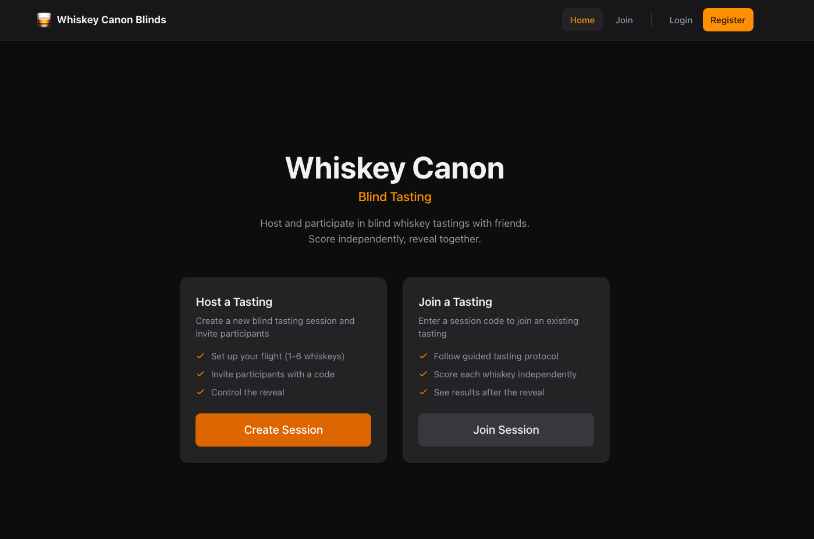
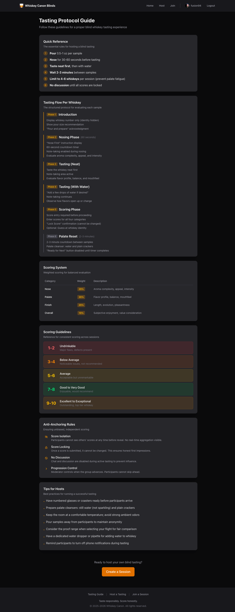

# Whiskey Canon Blinds

A web application for hosting blind whiskey tasting sessions. Eliminate bias, taste objectively, and discover your true preferences.

## What is Blind Tasting?

Blind tasting removes the influence of labels, prices, and reputations. Participants evaluate whiskeys purely on their sensory qualities—nose, palate, and finish—without knowing what they're drinking. This reveals genuine preferences and often produces surprising results.

## Screenshots

### Home Page


Start a new tasting session or join an existing one with an invite code.

### Tasting Protocol Guide


Built-in guide covering the complete tasting protocol, scoring system, and anti-anchoring rules.

## Key Features

### For Hosts
- **Create Sessions** - Set up flights with 1-6 whiskeys, define themes, and invite participants
- **Guided Protocol** - Structured phases ensure consistent tasting: pour, nose, palate (neat), palate (with water), score, palate reset
- **Control the Flow** - Advance participants through each phase and whiskey at your pace
- **Dramatic Reveal** - Unveil identities and scores together for maximum impact

### For Participants
- **Join Easily** - Enter a session with just an invite code
- **Score Independently** - Your ratings are private until the reveal
- **Tasting Notes** - Record detailed notes for each whiskey
- **See Results** - Compare your scores against the group after reveal

### Anti-Anchoring Design
Scores are completely isolated until the moderator initiates the reveal. Participants cannot see others' ratings, comments, or even whether they've finished scoring. This prevents groupthink and ensures honest evaluations.

### Social Features
- **Follow Users** - Connect with fellow enthusiasts
- **Public Profiles** - Share your tasting history and achievements
- **Achievements** - Earn badges for sessions attended, whiskeys rated, and more
- **Export Data** - Download your complete tasting history (GDPR compliant)

## Scoring System

| Category | Weight | What to Evaluate |
|----------|--------|------------------|
| Nose | 25% | Aroma complexity, appeal, intensity |
| Palate | 35% | Flavor profile, balance, mouthfeel |
| Finish | 25% | Length, evolution, pleasantness |
| Overall | 15% | Personal enjoyment |

Scores use a 1-10 scale. The total is a weighted average.

## Tech Stack

- **Frontend**: React 19, TypeScript, Vite, Tailwind CSS, Zustand
- **Backend**: Node.js, Express 5, SQLite, Drizzle ORM
- **Real-time**: Socket.io for live synchronization
- **Auth**: JWT with refresh tokens

## Getting Started

See [docs.md](docs.md) for installation instructions, API documentation, and project structure.

```bash
# Quick start
git clone https://github.com/fusion94/whiskey-canon-blinds.git
cd whiskey-canon-blinds
npm install
npm run dev
```

## License

Apache License 2.0 - see [LICENSE](LICENSE) for details.

---

*Taste responsibly. Score honestly.*
